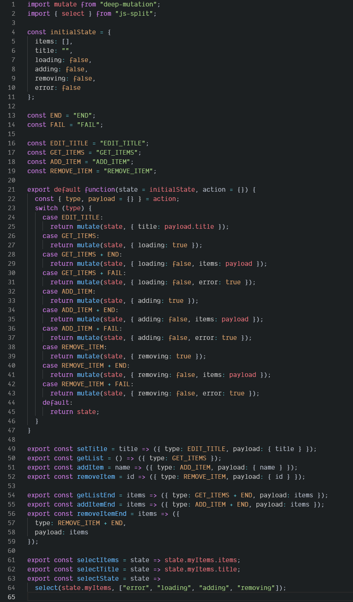

# redux-mill

1. [What is it?](#what-is-it)
1. [Reasons to use it](#you-should-try-it-if)
2. [Installation](#installation)
3. [Using](#Using)
    - [As simple object](#reducer-is-simple-object)
    - [As instance of function](#reducer-is-instance-of-function)
    - [As instance of class](#reducer-is-instance-of-class)
4. [Without and with comparison](#without-and-with-comparison)


## What is it?
`redux-mill` is the easy way to use redux by one object.
Main idea is possibility to use only one object to use actions, action creators and store.

## You should try it if

* You hate a lot of actions constants and very long imports of these constants
* You hate a lot of equal action creators and very long imports
* You want to use toor reducer path once in one place

## Installation

```
npm install --save redux-mill
```

## Using
It is easy to understand but there are some details.

#### Create your reducer
```javascript
  // myReducer.js
  import reduxMill from 'redux-mill';

  const initialState = { title: 'Default title' };

  const reducer = {
    EDIT_TITLE: (state, title) => ({ ...state, title }),
    SAVE: {
      // it is for SAVE action
      0: state => ({ state, saving: true, error: "" }),
      // it is for SAVE__END action
      END: (state, payload) => ({ ...state, saving: false }),
       // it is for SAVE__FAIL action
      FAIL: (state, payload) => ({ ...state, saving: false, error: payload.error })
    }
    // ...
  };

  export const store = reduxMill(
    initialState,
    reducer,
    'myStoreName',
    {
      // debug: true,
      // stateDebug: true,
      divider: "__",
      // it is divider between children and parent parts of key - SAVE__FAIL
      mainKey: 0
      // it is children key that means reaction for parent action
      // LOAD: { 0: state => ({ ...state }) }
      // is the same that
      // LOAD: state => ({ ...state })
    }
  );

  // selectors
  export const selectTitle = store(state => state.title);
  // ...
```

#### Connecting to your store

```javascript
  // store.js
  import { createStore, applyMiddleware } from "redux";
  import { store: myReducer } from './myReducer';
  import { store: mySecondReducer } from './mySecondReducer';

  const reducers = {
    ...myReducer,
    // it will be 'myStoreName' key
    ...mySecondReducer
  };

  export default createStore(
    combineReducers(reducers),
    applyMiddleware(...)
  );
```

#### Using action creator in component

```javascript
  import React, { PureComponent } from 'react';
  import { connect } from 'react-redux';
  import myReducer, { selectTitle } from './myReducer';

  class MyComp extends PureComponent {
    onClick = () => {
      const { changeTitle } = this.props;
      changeTitle('Title ' + Math.random());
    }

    render() {
      return (
        <div>
          <h3>{title}</h3>
        <button onClick={this.onClick}>
        </button>
        </div>
      )
    }
  }

  export default connect(
    (state) => ({
      title: selectTitle(state),
    }),
    {
      changeTitle: myReducer.EDIT_TITLE
      // myReducer.EDIT_TITLE is action creator function(payload)
    }
  )(MyComp);
```

### (!) `reducer` object will be changed after call of reduxMill
It will be object with the same structure, but each value will be action creator function(payload).

```javascript
  import reduxMill from 'redux-mill';
  const reducer = {
    EDIT_TITLE: (state, title) => ({ ...state, title }),
    SAVE: {
      0: state => state,
      END: state => state,
      FAIL: (state, payload) => ({ ...state, ...payload })
    }
  };
  export const store = reduxMill(
    initialState,
    reducer,
    'myStoreName',
    { divider: "__" }
  );

  // what will be in reducer object after reduxMill calling
  {
    EDIT_TITLE: function(payload) {
      this._ = 'EDIT_TITLE';
      this.toString = function() { return 'EDIT_TITLE' };
      this.toValue = function() { return 'EDIT_TITLE' };
      return { type: 'EDIT_TITLE': payload };
    },
    SAVE: function(payload) {
      this.END = function(payload) {
        this._ = 'SAVE__END';
        this.toString = function() { return 'SAVE__END' };
        this.toValue = function() { return 'SAVE__END' };
        return { type: 'SAVE__END': payload };
      },
      this.FAIL = function(payload) {
        this._ = 'SAVE__FAIL';
        this.toString = function() { return 'SAVE__FAIL' };
        this.toValue = function() { return 'SAVE__FAIL' };
        return { type: 'SAVE__FAIL': payload };
      },
      this._ = 'SAVE';
      this.toString = function() { return 'SAVE' };
      this.toValue = function() { return 'SAVE' };
      return { type: 'SAVE': payload };
    }
  };

  // hot it can be used
  console.log(reducer.EDIT_TITLE == 'EDIT_TITLE')
  // console:> true
  // (!!!) but
  console.log(reducer.EDIT_TITLE === 'EDIT_TITLE')
  // console:> false

  console.log(reducer.EDIT_TITLE._)
  // console:> EDIT_TITLE
  console.log(String(reducer.SAVE.FAIL))
  // console:> SAVE__FAIL
  console.log(reducer.EDIT_TITLE({ a: 10 }))
  // console:> { type: 'EDIT_TITLE', payload: { a: 10 } }

  console.log(reducer.SAVE.END({ a: 10 }))
  // console:> { type: 'SAVE__END', payload: { a: 10 } }
```

So `reducer` can be used as action type for `redux-saga`

```javascript
  takeEvery(reducer.EDIT_TITLE, ...);
```

or as action creator

```javascript
  reducer.EDIT_TITLE(newTitle);
```
### Description

reduxMill(`initialState`, `reducer`, `storeName`, `options`): function(selector: function(store, ...args));

| args  | type | default | description |
| - | - | - | - |
| `initialState` | Object | - | default state |
| `reducer` | Object | - | Object or instance of your class |
| `storeName` | String | - | it is name for redux store |
| `options` | Object | {[...](#options-includes-next-props)} | additional options |

#### Options includes next props ####
| args  | type | default | description |
| - | - | - | - |
| `debug` | Boolean | false | enable debug console logging |
| `stateDebug` | Boolean | false | enable debug state changes console logging |
| `divider` | String | '_' | it is divider between parent key and children subkey |
| `mainKey` | String | 0 | it is key for main handler for parent action name |

#### It returns function that is factory of selectors for REDUX[storeName]

```javascript
  const store = reduxMill(initialState, reducer, 'storeName');
  const selectItem = store((state, id) => state.items[id]);
  // it return function(state[, ...args])
  const selectItem2 = (state, id) => state['storeName'].items[id];
  // selectItem the same that selectItem2
  // state['storeName'] - is our current store
  // ...
```

## `reducer` is simple object

```js
  import { select } from "js-split";
  import mill from "./mill";

  const storeName = "myItems";
  const initialState = {
    items: [],
    title: "",
    loading: false,
    adding: false,
    removing: false,
    error: false
  };

  const END = "END";
  const FAIL = "FAIL";

  const reducer = {
    EDIT_TITLE: (state, title) => ({ ...state, title }),
    GET_ITEMS: {
      0: state => ({ ...state, loading: true, error: "" }),
      [END]: (state, payload) =>
        ({ ...state, loading: false, items: payload }),
      [FAIL]: state =>
        ({
          ...state,
          loading: false,
          error: "Somthing is wrong with items =("
        })
    },
    ADD_ITEM: {
      0: state => ({ ...state, adding: true, error: "" }),
      [END]: (state, payload) => ({ ...state, adding: false, items: payload }),
      [FAIL]: state =>
        ({ ...state, adding: false, error: "The same item there is in list" })
    },
    REMOVE_ITEM: {
      0: state => ({ ...state, removing: true, error: "" }),
      [END]: (state, payload) =>
        ({ ...state, removing: false, items: payload }),
      [FAIL]: state =>
        ({ ...state, removing: false, error: "It can't be removed" })
    }
  };
  // Use the same handler for another action
  reducer.DELETE_ITEM = reducer.REMOVE_ITEM;

  export const store = mill(initialState, reducer, storeName, {
    divider: "__",
    mainKey: 0
  });

  export const selectItems = store(state => state.items);
  export const selectTitle = store(state => state.title);
  export const selectError = store(state => state.error);

  export default reducer;
```

## `reducer` is instance of function

```js
  import { select } from "js-split";
  import mill from "./mill";

  const storeName = "myItemsM";
  const initialState = {
    items: [],
    title: "",
    loading: false,
    adding: false,
    removing: false,
    error: false
  };

  const END = "END";
  const FAIL = "FAIL";

  const reducer = new function() {
    this.EDIT_TITLE = (state, title) => ({ ...state, title });
    this.GET_ITEMS = {
      0: state => ({ ...state, loading: true, error: "" }),
      [END]: (state, payload) =>
        ({ ...state, loading: false, items: payload }),
      [FAIL]: state =>
        ({
          ...state,
          loading: false,
          error: "Somthing is wrong with items =("
        })
    };

    this.ADD_ITEM_BASE = {
      0: state => ({ ...state, adding: true, error: "" }),
      [END]: (state, payload) => ({ ...state, adding: false, items: payload }),
      [FAIL]: state =>
        ({ ...state, adding: false, error: "The same item there is in list" })
    };
    this.ADD_ITEM = {
      0: state => this.ADD_ITEM_BASE[0],
      [END]: (state, payload) => ({ ...state, adding: false, items: payload }),
      [FAIL]: state =>
        ({
          ...state,
          adding: false,
          error: "The same item  is in the list"
        })
    };

    this.REMOVE_ITEM = {
      0: state => ({ ...state, removing: true, error: "" }),
      [END]: (state, payload) =>
        ({ ...state, removing: false, items: payload }),
      [FAIL]: state =>
        ({ ...state, removing: false, error: "It can't be removed" })
    };

    // Use the same handler for another action
    this.DELETE_ITEM = this.REMOVE_ITEM;
  }();

  export const store = mill(initialState, reducer, storeName, {
    divider: "__",
    mainKey: 0
  });
  export default reducer;

  export const selectItems = store(state => state.items);
  export const selectTitle = store(state => state.title);
  export const selectError = store(state => state.error);

```

## `reducer` is instance of class

```js
  import { select } from "js-split";
  import mill from "./mill";

  const storeName = "myItemsM";
  const initialState = {
    items: [],
    title: "",
    loading: false,
    adding: false,
    removing: false,
    error: false
  };

  const END = "END";
  const FAIL = "FAIL";

  const reducer = new class {
    EDIT_TITLE = (state, title) => ({ ...state, title });
    GET_ITEMS = {
      0: state => ({ ...state, loading: true, error: "" }),
      [END]: (state, payload) =>
        ({ ...state, loading: false, items: payload }),
      [FAIL]: state =>
        ({ ...state, {
          loading: false,
          error: "Somthing is wrong with items =("
        })
    };

    ADD_ITEM = {
      0: state => ({ ...state, adding: true, error: "" }),
      [END]: (state, payload) => ({ ...state, adding: false, items: payload }),
      [FAIL]: state =>
        ({ ...state, adding: false, error: "The same item there is in list" })
    };

    REMOVE_ITEM = {
      0: state => ({ ...state, removing: true, error: "" }),
      [END]: (state, payload) =>
        ({ ...state, removing: false, items: payload }),
      [FAIL]: state =>
        ({ ...state, removing: false, error: "It can't be removed" })
    };

    // Use the same handler for another action
    DELETE_ITEM = this.REMOVE_ITEM;
  }();

  export const store = mill(initialState, reducer, storeName, {
    divider: "__",
    mainKey: 0
  });
  export default reducer;

  export const selectItems = store(state => state.items);
  export const selectTitle = store(state => state.title);
  export const selectError = store(state => state.error);

```

## Without and with comparison

#### Before => 64 lines / 4 actions constants / 7 action creators


#### After => 47 lines / 1 action creators export


#### External lib [`deep-mutation`](https://www.npmjs.com/package/deep-mutation) was used in examples, but it `IS NOT` required dependency.
